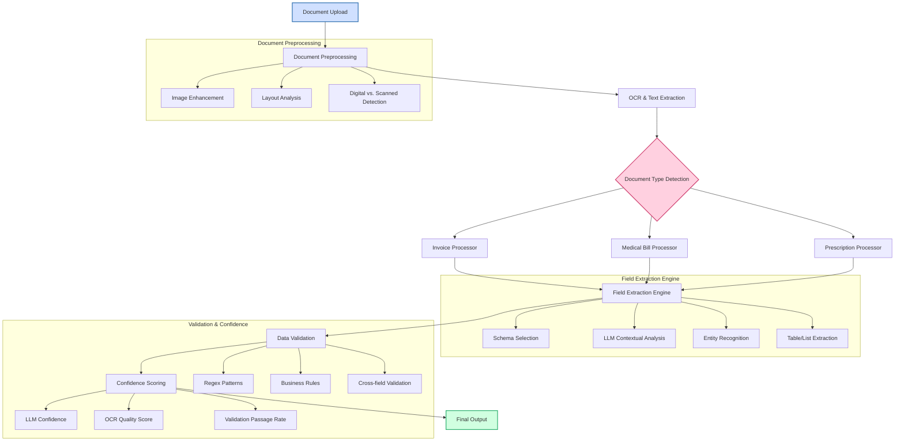

# Agentic Document Extraction System

A modular AI-powered document extraction system built with LangChain, OpenAI GPT, and Streamlit. The system automatically detects document types (invoices, medical bills, prescriptions) and extracts structured data with confidence scoring.

## 🚀 Features

- **Document Type Detection**: Automatically classifies documents into invoice, medical_bill, or prescription
- **OCR Support**: Handles both text-based PDFs and scanned images using pdfplumber, PyMuPDF, and pytesseract
- **Structured Extraction**: Uses OpenAI GPT with Pydantic schemas for reliable data extraction
- **Validation Layer**: Comprehensive validation with regex checks and business rules
- **Confidence Scoring**: Multi-factor confidence scoring combining LLM, OCR, and validation results
- **Interactive UI**: Clean Streamlit interface with real-time processing and visualization
- **Batch Processing**: Support for processing multiple documents

## 🛠 Tech Stack

- **AI/ML**: LangChain, OpenAI GPT-4
- **OCR**: pdfplumber, PyMuPDF, pytesseract
- **UI**: Streamlit
- **Data Models**: Pydantic
- **Image Processing**: OpenCV, Pillow
- **Language**: Python 3.8+

## 📋 Project Structure

```
agentic_doc_extraction/
│── data/                     # Sample documents
│── outputs/                  # Extracted results
│── src/
│   │── agent.py              # Main orchestrator using LangChain
│   │── routing.py            # Document type detection
│   │── ocr.py                # OCR + preprocessing
│   │── extraction.py         # LLM extraction chain
│   │── validation.py         # Regex + business rules
│   │── scoring.py            # Confidence scoring logic
│   │── ui_streamlit.py       # Streamlit frontend
│   │── schemas.py            # Pydantic models & JSON schemas
│   │── utils.py              # Helper functions
```

## 🏗️ Architectural Approach

The Agentic Document Extraction System uses a modular, pipeline-based architecture that combines several AI techniques for intelligent document processing:



## 🧠 Approach Methodology

### 1. Intelligent Document Routing

The system first analyzes document content and structure to automatically classify it into a specific document type. This routing process considers:

- Key phrases and terminology
- Document layout patterns
- Presence of specific fields
- Table structures and formatting

### 2. Adaptive OCR Pipeline

For documents requiring OCR:

- **Image Preprocessing**: Automatic adjustments for contrast, rotation, and noise reduction
- **Hybrid OCR**: Combines multiple OCR engines for optimal results
- **Post-OCR Cleanup**: Corrects common OCR errors and improves text quality

### 3. LLM-Powered Extraction

The extraction engine uses OpenAI's GPT models with:

- **Schema-Guided Extraction**: Pydantic models define expected fields and types
- **Contextual Understanding**: Identifies fields based on surrounding context
- **Format Recognition**: Adapts to various formats within the same document type
- **Confidence Assessment**: Model reports confidence for each extracted value

### 4. Multi-layered Validation

The validation layer applies:

- **Pattern Matching**: Validates fields using regex patterns (e.g., dates, numbers, IDs)
- **Business Logic**: Applies document-specific rules (e.g., totals must match sum of line items)
- **Consistency Checks**: Verifies that related fields are consistent

### 5. Advanced Confidence Scoring

Confidence scores for each field combine:

- **LLM Confidence**: Self-reported confidence from the language model (60%)
- **OCR Quality**: Assessment of text extraction quality (20%)
- **Validation Success**: Whether the field passes validation rules (20%)

### 6. Interactive User Interface

The Streamlit UI provides:
- Real-time processing feedback
- Interactive visualization of extraction results
- Field-by-field confidence indicators
- Structured data view and JSON export

## 📄 Supported Document Types

- **Invoices**: Invoice number, date, vendor information, line items, totals
- **Medical Bills**: Patient information, hospital details, services, charges
- **Prescriptions**: Patient and doctor information, medications with dosages

## 📊 Example Output

```json
{
  "doc_type": "invoice",
  "fields": [
    {
      "name": "invoice_number",
      "value": "INV-2024-001",
      "confidence": 0.95
    },
    // Additional fields...
  ],
  "overall_confidence": 0.91,
  "validation": {
    "passed_rules": ["totals_match", "date_format_valid"],
    "failed_rules": []
  }
}
```

## 🎯 Benefits of This Approach

- **Accuracy**: Multi-layered approach results in higher extraction accuracy
- **Transparency**: Detailed confidence scoring shows reliability of extracted data
- **Adaptability**: System can handle variations in document format and quality
- **Extensibility**: New document types can be added with minimal code changes
- **Robustness**: Graceful degradation when dealing with poor quality documents

## 📈 Performance Considerations

- Processing time varies based on document complexity and quality
- OCR-heavy processes require more computational resources
- LLM API calls are optimized to reduce token usage
- Batch processing for efficiency with multiple documents

## 🙏 Acknowledgments

- LangChain for the orchestration framework
- OpenAI for the language models
- Streamlit for the web interface
- The open-source OCR community
